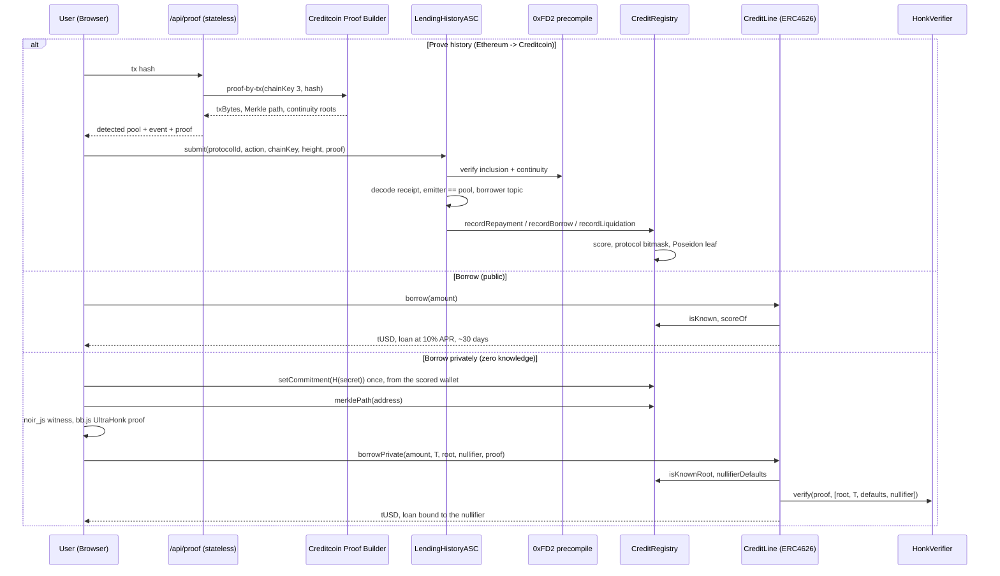
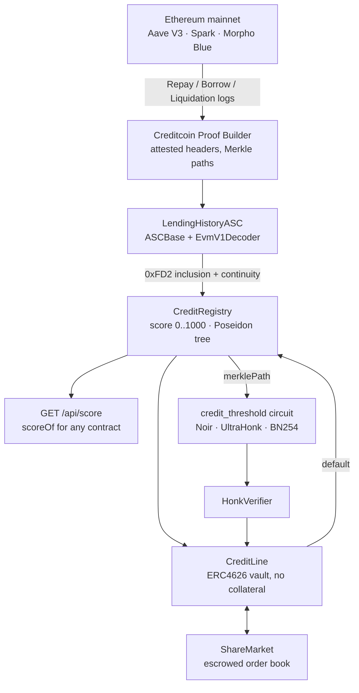

<p align="center">
  
</p>

<h1 align="center">CreditPass</h1>

<p align="center">
  Under-collateralised lending on Creditcoin, priced by a credit history that is proved rather than reported — a wallet's real Aave, Spark and Morpho record verified through the Attestcoin Protocol, turned into a public score, lent against with no collateral, and usable in zero knowledge from any wallet.
</p>

<p align="center">
  
  
  
  
  
  
  
</p>

<p align="center">
  <a href="#overview">Overview</a> ·
  <a href="#why-creditpass">Why CreditPass</a> ·
  <a href="#the-system-flows">System Flows</a> ·
  <a href="#smart-contracts">Contracts</a> ·
  <a href="#how-it-works">How It Works</a> ·
  <a href="#architecture">Architecture</a> ·
  <a href="#attestcoin-protocol-integration">Attestcoin</a> ·
  <a href="#private-credit-zero-knowledge">Private Credit</a> ·
  <a href="#quick-start">Quick Start</a>
</p>

<p align="center">
  <a href="https://buid-ctc.vercel.app">Live app</a> ·
  <a href="https://github.com/maulana-tech/buid-ctc">Repository</a> ·
  <a href="./DEPLOY.md">Deploy guide</a>
</p>

---

## Overview

CreditPass is a credit layer on Creditcoin. A wallet's borrow, repay and liquidation history on Ethereum mainnet — Aave V3, Spark, Morpho Blue — is proved on Creditcoin through the **Attestcoin Protocol**: Merkle inclusion and continuity are verified inside the contract by the native block-prover precompile, in one block, with nothing taken on trust. `CreditRegistry` turns the proved entries into a non-transferable score from 0 to 1000. `CreditLine`, an ERC4626 vault funded by depositors, lends against that score **with no collateral**. `ShareMarket` lets a depositor exit while their capital is out on loan.

On top of the public score sits a **zero-knowledge private credit** path: the scored address publishes one commitment, and from then on any wallet can prove in the browser that a committed profile clears a score band — without naming the address or the exact score — and borrow that band's limit.

> **One registry. Five flows. One rule: the history is proved, never reported.**
>
> - **Prove** turns an Ethereum transaction hash into an attested credit entry, from the app, signed by your own wallet.
> - **Borrow** draws against the score with no collateral. Tiered limits, 10% simple APR, ~30-day term.
> - **Earn** supplies the vault and takes the interest borrowers pay. Depositors are the collateral.
> - **Swap** is an escrowed order book for vault shares — the way out when the pool is fully lent.
> - **Private Borrow** proves "score ≥ T" in zero knowledge from any wallet. Defaults charge a nullifier, never the address.

---

## Table of Contents

- [Overview](#overview)
- [Why CreditPass](#why-creditpass)
- [The System Flows](#the-system-flows)
- [Smart Contracts](#smart-contracts)
- [How It Works](#how-it-works)
- [Architecture](#architecture)
- [Attestcoin Protocol Integration](#attestcoin-protocol-integration)
- [Scoring](#scoring)
- [Private Credit (Zero Knowledge)](#private-credit-zero-knowledge)
- [Tech Stack](#tech-stack)
- [Key Files](#key-files)
- [Verification](#verification)
- [Quick Start](#quick-start)
- [Known Limits](#known-limits)
- [Ecosystem](#ecosystem)
- [Roadmap](#roadmap)
- [Hackathon](#hackathon)
- [License](#license)

---

## Why CreditPass

DeFi lending is over-collateralised, so it only serves people who already have capital. The missing ingredient is reputation. A lender on Creditcoin cannot know whether a borrower has ever repaid anything, because that history lives on another chain — and any off-chain claim about it has to be trusted.

The existing options fall short:
- **Indexer APIs and oracles** — "this wallet repaid eleven Aave loans" becomes somebody's HTTP response. Unsecured credit on an unverifiable claim is a faucet with extra steps.
- **Bridging collateral** — brings the capital requirement back, which is the problem being solved.
- **Fresh wallets** — a clean address has no history to borrow against, and a bad address can simply move.

**How can Creditcoin lend against a borrower's real record without trusting anyone to report it?**

CreditPass answers with five primitives:
1. **Attestcoin proofs, verified in-contract** — the `LendingHistoryASC` calls the `0xFD2` block-prover precompile for Merkle inclusion and continuity, decodes the receipt with `EvmV1Decoder`, and checks the log came from that protocol's real pool. The worker that fetches proofs is untrusted infrastructure; it can only choose what to present.
2. **A public score primitive** — any contract on Creditcoin can call `scoreOf(address)`; anything off-chain can `GET /api/score/<address>`. The vault is one consumer of it; the registry is the product.
3. **Protocols as configuration** — pool address, chain key, event signature and borrower topic index are stored on chain per protocol. Adding a lending protocol is a transaction, not a redeploy.
4. **A vault where depositors are the collateral** — ERC4626 shares, interest lands at repayment, defaults are written off against depositors and cost the borrower 300 points on the same registry the Ethereum history feeds. One reputation across both chains.
5. **Selective disclosure in zero knowledge** — a Noir circuit over a Poseidon tree the registry keeps, an UltraHonk verifier on chain, proofs generated in the browser. The passport is public; using it does not have to be.

<details>
<summary><b>Meet Dana</b> — the person this is for</summary>

<br>

Dana has borrowed and repaid on Aave for three years without a single liquidation. On every lending protocol she is still a stranger: to borrow $500 she posts $750. On Creditcoin she pastes one repayment hash into CreditPass; the Attestcoin proof is verified on chain and her passport starts at 325. Eight time-separated repayments later she is at 500 and the credit line opens — no collateral, from a vault funded by depositors who are paid for underwriting exactly her record. When she does not want the lender to know which Ethereum address she is, she proves "at least 500" from a fresh wallet instead. If she ever defaults, that identity carries the mark forever, on both channels.

</details>

---

## The System Flows

Every flow reads or writes the same registry; only the contract and the proof change.

| Flow | **Prove** | **Borrow** | **Earn** | **Swap** | **Private Borrow** |
|---|---|---|---|---|---|
| **Direction** | Ethereum mainnet → Creditcoin | Vault → borrower | Depositor → vault | Share holder ↔ buyer | Vault → any wallet |
| **Contract** | `LendingHistoryASC` → `CreditRegistry` | `CreditLine.borrow` | `CreditLine.deposit` / `withdraw` | `ShareMarket` | `CreditLine.borrowPrivate` |
| **Proof** | Attestcoin: Merkle inclusion + continuity, verified by `0xFD2` | none — score read from the registry | none | none | UltraHonk over the `credit_threshold` Noir circuit |
| **Inputs** | one transaction hash | amount ≤ tier limit | tUSD in, cpUSD out | shares at a listed per-share price | threshold band, amount, root, nullifier, proof |
| **Effect** | credit entry recorded, score moves | loan opened, 10% simple APR, ~30-day term | shares minted at the current share price | escrowed shares change hands, whole or partial | loan opened against a nullifier |
| **On default** | — | −300 points, line closed, depositors absorb the loss | share price drops | — | nullifier charged; future proofs subtract 300 |
| **What stays hidden** | nothing — provenance is the point | nothing | nothing | nothing | which address, and the exact score |

---

## Smart Contracts

### Addresses (Creditcoin Testnet, chain 102031)

Deployed with `npm run deploy:testnet`. Every address and transaction links to Blockscout.

| Contract | Address | Description |
|---|---|---|
| **CreditRegistry** | [`0x6d4d017dE8d0A36dce7856Ee989624C6A18cD9Ea`](https://creditcoin-testnet.blockscout.com/address/0x6d4d017dE8d0A36dce7856Ee989624C6A18cD9Ea) | The primitive. One non-transferable profile per address, score 0–1000, protocol bitmask. Only registered reporters may write. |
| **LendingHistoryASC** | [`0xD04A92C83AFe71f4f69F9FAD0A33229BFBdE33E6`](https://creditcoin-testnet.blockscout.com/address/0xD04A92C83AFe71f4f69F9FAD0A33229BFBdE33E6) | The Attestcoin Smart Contract. Verifies a proof, decodes the receipt, checks the emitter, records the entry. Protocols stored as data. |
| **CreditLine** (`cpUSD`) | [`0x970C3114C5Dcf853692bc8D3e0598d1AC9D12185`](https://creditcoin-testnet.blockscout.com/address/0x970C3114C5Dcf853692bc8D3e0598d1AC9D12185) | ERC4626 vault. Depositors supply and earn; borrowers draw against their score with no collateral. |
| **ShareMarket** | [`0x9833C746a7ef59BbA70bDb27073d04ED8B9EfE1e`](https://creditcoin-testnet.blockscout.com/address/0x9833C746a7ef59BbA70bDb27073d04ED8B9EfE1e) | Escrowed order book for vault shares, whole and partial fills at the listed price. |
| **TestUSD** (`tUSD`) | [`0x44b99f76f12e0Ece22f6bD76DcB305Afcf25876D`](https://creditcoin-testnet.blockscout.com/address/0x44b99f76f12e0Ece22f6bD76DcB305Afcf25876D) | Testnet-only mintable stablecoin stand-in. |
| **HonkVerifier** | _next deploy_ | UltraHonk verifier generated by Barretenberg from `circuits/credit_threshold`. |
| **PoseidonT3** | _next deploy_ | Poseidon over BN254 (circomlib parameters), called by the registry to keep its Merkle tree. |

> The private-credit contracts are built, tested with real proofs and exercised end to end on a local chain (see [Verification](#verification)). The testnet set above predates them; `npm run deploy:testnet` ships the full stack.

### Live Attestcoin Proof Verification (E2E)

Real Ethereum mainnet repayments, one per protocol, verified by Creditcoin's **live block-prover precompile** and written as credit profiles:

| Protocol | Ethereum block | Borrower | Creditcoin tx | Gas |
|---|---|---|---|---|
| Aave V3 | 25,903,010 | `0x3078a7B4…46f7` | [`0xac1b8a24…ade36`](https://creditcoin-testnet.blockscout.com/tx/0xac1b8a2462811a40c08178e2839c83153eddf55c909ee8e31b76960659aade36) | 313,614 |
| Spark | 25,903,010 | `0x3B7E7B3A…5752` | [`0x3792c74e…a487b`](https://creditcoin-testnet.blockscout.com/tx/0x3792c74e4f0589508293079e218977dbe8be9998d7e7fab2d8e1c1f4cdca487b) | 313,614 |
| Morpho Blue | 25,903,012 | `0x8297492D…1070` | [`0xe424945f…33da2`](https://creditcoin-testnet.blockscout.com/tx/0xe424945f8f7a62d18c091ca25567797aaa0dcf093501f56cb4fec11a23233da2) | 340,942 |

**Guards observed refusing, on chain:** resubmitting a proof reverts on the query-id dedupe; an Aave transaction submitted under Morpho's protocol id reverts on the emitter check. Both left no logs and no state.

**Market exercised on chain:** two `fillPartial` trades from a second account (3,000 shares @ 0.97, 1,500 @ 0.99); the book shrank accordingly and both prints appear on the swap chart.

---

## How It Works

**User Flow** — `Connect → Prove → Borrow / Earn → Swap → Borrow privately`
1. **Connect** any EIP-6963 wallet; the app switches it to Creditcoin testnet.
2. **Prove** a repayment: paste the Ethereum transaction hash on the History page. The app detects the pool and event, fetches the Attestcoin proof, and your wallet submits it to the ASC. The registry's own events say whether it counted.
3. **Borrow** once the score clears 500, or **Earn** by supplying tUSD to the vault at the rate borrowers pay.
4. **Swap** vault shares on the escrowed order book when the pool is fully lent.
5. **Borrow privately**: publish a commitment from the scored wallet once, then prove and draw from any other wallet.

**Proof Flow (Attestcoin)** — `Receipt → detect event → Proof Builder → wallet signs → precompile verifies`
1. `POST /api/proof` reads the Ethereum receipt, matches a registered pool and event signature, and asks the Creditcoin Proof Builder for the proof. The server never holds a key.
2. The browser calls `LendingHistoryASC.submit(...)` from the user's wallet.
3. The ASC re-enters `execute()` with chain key, block height and protocol id in context; `ASCBase` verifies inclusion and continuity through `0xFD2` and dedupes by query id.
4. `EvmV1Decoder` checks the receipt succeeded and finds the log; the emitter must be that protocol's real pool; the borrower comes from the configured topic index.
5. `CreditRegistry` records the entry. Repayments closer than ~1 day to the last counted one are recorded but not counted.

**Proof Flow (Zero Knowledge, browser)** — `Identity → Merkle path from the registry → Noir witness → UltraHonk → CreditLine`
1. The scored wallet publishes `H(secret)` with `setCommitment`. The secret stays in the browser.
2. Any wallet reads `merklePath(address)` from the registry — no client-side tree — and executes the `credit_threshold` circuit with noir_js.
3. bb.js generates a zero-knowledge UltraHonk proof with a keccak transcript, about 30 seconds in a tab.
4. `CreditLine.borrowPrivate` checks the root is recent, supplies the defaults charged to the nullifier itself, verifies the proof, and lends the tier the threshold is worth.

**On-chain Flow**
```
Wallet                    LendingHistoryASC                0xFD2 precompile          CreditRegistry
  |                              |                                |                       |
  |-- submit(proof, ...) ------->|                                |                       |
  |                              |-- verify inclusion+continuity ->|                       |
  |                              |<-- ok, queryId ----------------|                       |
  |                              |-- decode receipt, check pool   |                       |
  |                              |-- recordRepayment(user, ...) ------------------------->|
  |                              |                                |     score moves       |
  |<-- HistoryProved ------------|                                |                       |

Fresh wallet              CreditLine                       HonkVerifier              CreditRegistry
  |                              |                                |                       |
  |-- borrowPrivate(T, root, n, proof) -->                        |                       |
  |                              |-- isKnownRoot(root)? nullifierDefaults(n)? ----------->|
  |                              |-- verify(proof, [root, T, defaults, n]) -->|            |
  |                              |<-- true ------------------------|                       |
  |<-- amount, loan bound to n --|                                |                       |
```

---

## Architecture

### System Flow



### Data Pipeline



---

## Attestcoin Protocol Integration

_This section is the "Attestcoin Protocol Integration Summary" for the submission form._

**Remove Attestcoin and there is no project left.** "This wallet repaid eleven Aave loans and was never liquidated" is, without attestation, a claim from somebody's API — and unsecured credit extended on an unverifiable claim is a faucet with extra steps. The protocol replaces that trust with proof: a staked attestor set confirms Ethereum block headers on Creditcoin, and the Attestcoin Smart Contract verifies a specific transaction against them via the native block-prover precompile.

### Surfaces used

| Attestcoin surface | Where | What for |
|---|---|---|
| `ASCBase` (readability base) | `LendingHistoryASC` | proof verification via `execute`, query-id dedupe |
| `INativeQueryVerifier` precompile at `0xFD2` | via `ASCBase` | Merkle inclusion + continuity, synchronous |
| `EvmV1Decoder` | `LendingHistoryASC._borrowerFrom` | transaction type, receipt status, log selection by signature |
| `PrecompileChainInfoProvider` | `worker/`, `script/` | latest attested height per chain key |
| Proof Builder API (`proof-by-tx`) | `web/src/app/api/proof`, `worker/index.ts`, `script/prove.ts` | fetch the proof for a transaction |
| Source-chain event design | `worker/protocols.ts` → on-chain `EventSpec` | canonical emitter, per-protocol borrower topic index |

### What the ASC enforces

| Check | Why it exists |
|---|---|
| **Canonical emitter** — the log must come from that protocol's real pool | anyone can deploy a contract that emits a perfect `Repay` event naming someone else |
| **Chain key pinned per protocol** | a proof from another attested chain, where the attacker controls the emitting address, must not pass the emitter check |
| **Receipt status == 1** | a reverted transaction is still in the block and its proof still verifies; a failed repayment must not count |
| **Query-id dedupe** (`ASCBase`) | one source transaction, one credit entry, forever |
| **`submit()` re-enters `execute()` with context** | `ASCBase` forwards neither `chainKey` nor `blockHeight` to the handler; `submit` stashes both plus the protocol id, and a direct `execute` call reverts on empty context |

### Depth

- **Three protocols, nine event shapes**, stored on chain as data. Morpho carries the borrower in topic 3 where the Aave forks use topic 2 — the reason the index is configuration, not a constant.
- **Historical attestation measured**, not assumed: proofs served for Ethereum blocks back to 16,600,000 (the Aave V3 launch era, ~3.2 years) in 10–15 seconds each.
- **The decoder was tested on real chain data**: `test/RealProof.t.sol` replays genuine mainnet transactions with genuine proofs through the real `EvmV1Decoder`. Only the `0xFD2` precompile is mocked, because it is a pallet-evm runtime precompile with no bytecode.
- **Then the real precompile was used** — see the three testnet transactions above.
- **A default on Creditcoin writes back into the same registry the Ethereum history feeds**, so the score is one reputation across both chains.

### Protocols

| id | Protocol | Pool (Ethereum) | Repay | Liquidation | Borrow |
|---|---|---|---|---|---|
| 0 | Aave V3 | `0x87870Bca…4E2` | topic 2 | topic 3 | topic 2 |
| 1 | Spark | `0xC13e21B6…987` | topic 2 | topic 3 | topic 2 |
| 2 | Morpho Blue | `0xBBBBBbbB…FCb` | topic 3 | topic 3 | topic 2 |

The table lives in `worker/protocols.ts` and is written on chain by `npm run register:protocols`. **Compound V3 is deliberately absent:** repaying in Comet is a `Supply` of the base asset, indistinguishable from an ordinary supply without reading debt state.

---

## Scoring

Fully on chain — no model, no oracle, no off-chain computation:

```
base                300
+ repayments        25 each, capped at 20 counted   (max +500)
+ history age       10 per ~30 days of span         (max +100)
- liquidations      150 each
- defaults          300 each
clamped to [0, 1000]
```

Counts, not amounts: summing token amounts across reserves would need a price feed, and importing a centralised oracle into a project whose pitch is "no centralised oracle" is not a trade worth making. Repayments closer together than ~1 day count once, across all protocols — otherwise a wallet farms a score with micro-loans in an afternoon. Liquidations and defaults are never rate-limited.

Credit limit by score: below 500 closed · 500–599 1× · 600–699 2× · 700–799 5× · 800+ 10× the base unit. 10% simple APR per block, ~30-day term, `markDefault` is permissionless after the due block. The passport page shows the formula term by term and how many counted repayments the next band needs.

**The vault.** `totalAssets()` = idle cash + principal out on loan. Interest lands when a loan is repaid and lifts the share price; a default writes principal off and cuts it. Supply APR = borrow APR × utilisation, so an idle vault truthfully pays zero. `maxWithdraw` is capped by cash on hand; the share market is the way out when the pool is fully lent.

---

## Private Credit (Zero Knowledge)

The passport is public on purpose. Private credit is how you use it without being seen.

```
scored address ──setCommitment(H(secret))──▶ CreditRegistry   leaf = H(H(address, score), commitment)
                                                              │  Poseidon tree, depth 16, root history 32
any wallet ──borrowPrivate(amount, T, root, nullifier, proof)─▶ CreditLine ──verify──▶ HonkVerifier
```

The Noir circuit (`circuits/credit_threshold`, 6,584 constraints) proves: I know `secret` whose commitment sits in a leaf under `root` together with an address and its score, `nullifier = H(secret, 1)`, and `score ≥ T + 300 × defaults`. Public inputs are exactly `root`, `T`, `defaults`, `nullifier`. The contract supplies `defaults` from its own storage so the prover cannot understate it, and accepts any of the last 32 roots so a proof is not invalidated by an unrelated update.

| | Public | Hidden |
|---|---|---|
| The band you proved | ✓ | |
| The borrowing wallet | ✓ | |
| Which address holds the history | | ✓ |
| The exact score | | ✓ |
| Repeat loans by one identity | linkable via the nullifier | |
| A default on a private loan | charged to the nullifier | never to the address |

- Limit = the tier `T` falls in. Prove a lower band than you hold and you borrow less — selective disclosure is the feature.
- One open loan per identity (`nullifierHasLoan`). Repay releases it.
- Every later private proof must subtract 300 per default; the public passport stays clean. The identity carries the mark, which is the whole point of a nullifier that is deterministic per secret.
- Proving happens in the browser (noir_js + bb.js, WASM): about 30s single-threaded in a tab, 3s multi-threaded in Node. The secret never leaves the browser.
- Hashing is circomlib-parameter Poseidon over BN254 on both sides — `poseidon-solidity` in the registry, the `noir-lang/poseidon` library in the circuit, `poseidon-lite` in the browser — verified hash-equal.

`test/PrivateCredit.t.sol` runs a real UltraHonk proof through the real verifier. Its first assertion is that the contract's Poseidon tree reaches the same root JavaScript computed (`script/make-zk-fixture.ts`), so a hashing or layout mismatch fails there, not as an opaque `InvalidProof`.

---

## Tech Stack

| Layer | Technology |
|---|---|
| **Contracts** | Solidity 0.8.30, Foundry, OpenZeppelin 5 (ERC4626), `@gluwa/asc-contracts` 0.2.1 (`ASCBase`, `EvmV1Decoder`, `INativeQueryVerifier`) |
| **Attestation** | Attestcoin Protocol: block-prover precompile `0xFD2`, Creditcoin Proof Builder, `@gluwa/usc-sdk` 0.18.0 |
| **Zero knowledge** | Noir `1.0.0-beta.9`, Barretenberg `0.87.0`, UltraHonk over BN254 (keccak transcript, ZK flavour), Poseidon (circomlib parameters), `poseidon-solidity`, `poseidon-lite` |
| **Web** | Next.js 16 (Turbopack), React 19, Tailwind 4, shadcn, ethers v6, lightweight-charts (TradingView), `@noir-lang/noir_js`, `@aztec/bb.js` |
| **Wallets** | EIP-6963 discovery, `wallet_switchEthereumChain` / `wallet_addEthereumChain` to Creditcoin testnet |
| **Networks** | Creditcoin testnet (chain 102031, ~15s blocks) reading Ethereum mainnet (chain key 3); Anvil for the local stack |
| **Explorer** | Blockscout on every address and transaction; Etherscan for source blocks and pools |
| **Hosting** | Vercel — https://buid-ctc.vercel.app |

---

## Key Files

| Component | Directory / File | Description |
|---|---|---|
| **Contracts** | [`contracts/`](./contracts/) | `CreditRegistry`, `LendingHistoryASC`, `CreditLine`, `ShareMarket`, `TestUSD`; `zk/` holds the generated `HonkVerifier`, the Poseidon interface and the verifier interface |
| **Noir circuit** | [`circuits/credit_threshold/`](./circuits/credit_threshold/) | `src/main.nr`, compiled circuit and verification key under `target/` |
| **Protocol table** | [`worker/protocols.ts`](./worker/protocols.ts) | the one source of truth for pools, event signatures and borrower topic indexes; written on chain by `register-protocols.ts` |
| **Worker** | [`worker/`](./worker/) | untrusted scanner + prover, signature check against live mainnet logs, attestation depth probe |
| **Scripts** | [`script/`](./script/) | `deploy-testnet.ts`, `local.ts` (Anvil with the `0xFD2` mock), `prove.ts`, `make-fixtures.ts`, `make-zk-fixture.ts`, `check-abi.ts`, `Deploy.s.sol` |
| **Tests** | [`test/`](./test/) | 5 Foundry suites, 65 tests; `fixtures/` real mainnet proofs and the ZK fixture; `mocks/` the precompile stand-in; `harness/` |
| **Web app** | [`web/`](./web/) | landing (`/`), dashboard (`/app/*`: passport, portfolio, history, borrow, private, earn, withdraw, swap), `api/score`, `api/proof`, `lib/zk` browser prover |
| **Deploy guide** | [`DEPLOY.md`](./DEPLOY.md) | wallet, faucet, preflight, verification, failure paths, troubleshooting, redeploy |

---

## Verification

| What | How | Result |
|---|---|---|
| Contract logic | `forge test` — 5 suites | **65 passed** |
| Real chain data through the real decoder | `test/RealProof.t.sol` replays mainnet Aave / Spark / Morpho transactions with real proofs from the Proof Builder; only `0xFD2` is mocked | passed |
| Live precompile | three proofs on testnet, two guards refusing | see [Smart Contracts](#smart-contracts) |
| Private credit end to end | `test/PrivateCredit.t.sol`: Solidity Poseidon tree equals the JS tree, real UltraHonk proof verified on chain, threshold / nullifier / root binding, one loan per identity, default charged to the nullifier | 11 passed |
| Browser prover | `cd web && npm run zk:selftest` — noir_js + bb.js prove the fixture statement and verify it | 16,224-byte proof in ~3s, verified |
| Private borrow in the browser | Anvil + `npm run local`: scored wallet publishes a commitment, two other wallets each prove and draw 100 tUSD, repay releases the identity, the Borrow page shows the loan as private | passed, ~30s per proof |
| Event signatures | `npm run check:sigs` against live mainnet logs | 9 / 9 match, 4 topics each |
| Dashboard ABIs vs compiled contracts | `npm run check:abi`, part of `npm run verify` | no drift |
| Attestation depth | `npm run check:attestation` | proofs served back to block 16.6M (~3.2 years) |

Attestation depth, measured against the live testnet Proof Builder:

| Source block | Age | Proof time |
|---|---|---|
| 25,883,406 | 1 day | ~2s |
| 24,902,888 | ~4 months | ~6s |
| 23,402,899 | ~10 months | 15s |
| 18,500,000 | ~2.5 years | 10s |
| 16,600,000 | ~3.2 years | 14s |

A trap worth knowing: the SDK's `ProofBuilder` defaults to a 10-second HTTP timeout, and deep history takes ~15s. The failure reads "not yet attested", which points at the wrong cause. The worker and the API route pass 60s explicitly.

---

## Quick Start

### Prerequisites

- Node.js 20+ and `npm` (the web app also works with `pnpm`)
- [Foundry](https://book.getfoundry.sh/) — `forge`, `anvil`
- A browser wallet (MetaMask or any EIP-6963 wallet); the app adds Creditcoin testnet itself
- Optional, only to change the circuit: `nargo` `1.0.0-beta.9` and `bb` `0.87.0`. The compiled circuit, verification key and verifier are committed.

### 1. Install and verify

```bash
npm install
npm run verify        # ABI drift check, both Foundry profiles, 65 tests
```

The Honk verifier does not compile with `via_ir`, and the rest of the project does not compile without it, so the verifier has its own profile (`FOUNDRY_PROFILE=zk`). `npm run verify` builds both.

### 2. Run everything locally — no testnet funds needed

```bash
npm run anvil                        # terminal 1: anvil --chain-id 102031
npm run local                        # terminal 2: deploy, wire, register, seed, replay real proofs, list an offer
cd web && npm install && npm run dev # terminal 3
```

The one thing a local chain cannot have is the `0xFD2` verifier; `anvil_setCode` installs the test mock there and **everything else is real**, including mainnet proofs from `test/fixtures`. `npm run local` writes `web/.env.local`, prints a real borrower to look up, and gives the Anvil dev account a score of 500 so borrow, repay, supply, withdraw, the market and private credit can all be exercised. Import the printed key into your wallet.

Open `http://localhost:3000/app`.

### 3. Deploy to Creditcoin testnet

See **[DEPLOY.md](./DEPLOY.md)** — wallet, faucet, preflight, verification, the failure paths worth testing, and troubleshooting. In short:

```bash
cp .env.example .env            # set CREDITCOIN_WALLET_PRIVATE_KEY
npm run verify
npm run deploy:testnet          # preflight, deploy all seven contracts, wire, register, seed, write web/.env.local
npm run prove -- <txHash> <protocolId> <Repay|Liquidation|Borrow>
```

### 4. Prove the browser prover

```bash
cd web && npm run zk:selftest   # noir_js + bb.js prove the fixture statement and verify it
```

### Scripts

| Command | Does |
|---|---|
| `npm run verify` | `check:abi` + `forge build` + `FOUNDRY_PROFILE=zk forge build` + all tests |
| `npm run check:sigs` | every protocol event signature against live mainnet logs |
| `npm run check:attestation [block] [txHash]` | attested heights; probe a block; build a proof — no wallet needed |
| `npm run worker -- <address>` | scan all protocols for an address, prove, submit |
| `npm run prove -- <txHash> <id> <kind>` | prove one known transaction without scanning (free RPCs refuse wide `eth_getLogs`) |
| `npm run register:protocols` | write `worker/protocols.ts` into a deployed ASC — how a protocol is added later |
| `npm run make:fixtures` | refresh the real-proof test fixtures |
| `npm run zk:build` | compile the circuit, write the vk and the Solidity verifier, copy the circuit to the web app |
| `npm run zk:fixture` | regenerate the real-proof ZK fixture for `test/PrivateCredit.t.sol` |

### Product routes

| Route | What it does |
|---|---|
| `/` | Landing page. Its figures strip is read from the deployed contracts through the same loaders the dashboard uses |
| `/app` | **Passport.** The connected wallet's score, the registry formula term by term, points to the next band, recent proofs, a public link + JSON API. Any address can be looked up read-only |
| `/app/portfolio` | **Portfolio.** Net position, allocation across wallet / vault / market escrow, what needs attention, one activity timeline merged from every contract the wallet touched |
| `/app/history` | **History.** Every transaction the wallet has proved, each row expanding to its provenance — and **Prove a transaction** from a bare hash |
| `/app/borrow` | Credit line by tier, borrow and repay with interest and headroom projections, due date in days; the prove flow while the score is below the line |
| `/app/private` | **Private credit.** Enable on the scored wallet, then prove and borrow from any wallet with the proof generated in the tab |
| `/app/earn` | Supply APR and where it comes from; line chart of share price / vault size / utilisation; the wallet's position with yield against its entry price; the borrower book the vault lends to |
| `/app/withdraw` | Redeem shares, with the liquidity cap shown up front |
| `/app/swap` | Share market as a swap: candlestick chart of redemption value and trades; "you pay / you receive" plans across the cheapest listed offers with a partial fill on the last |
| `GET /api/score/<address>` | The score and history as JSON. No key, no signup |
| `POST /api/proof` `{ txHash }` | Detects the pool and event in an Ethereum transaction and returns the Attestcoin proof ready for `LendingHistoryASC.submit()` |

---

## Known Limits

- **No collateral, by design and by necessity.** Attestcoin readability cannot seize an asset on Ethereum, and Ethereum cannot read Creditcoin, so cross-chain collateral is not enforceable today. Enforcement is reputational: a default costs 300 points and closes the line.
- **Interest reaches `totalAssets` at repayment, not per block.** The share price steps rather than drifts, so a depositor joining just before a large repayment captures interest they did not fund. A per-block index is the fix when it matters.
- **No reserve fund, no fees.** 100% of interest to depositors, 100% of default loss to depositors.
- **Partial fills have no minimum size.** One-unit fills could spam events; add a floor when the book is busy.
- **Yield on Earn is measured against the wallet's own deposit entry price.** Shares bought on the market have an entry price the vault never saw; the card says so rather than guessing.
- **Testnet asset.** `TestUSD.mint` is public on purpose. Before mainnet: real asset, remove the mint, audit, and revisit the two simplifications above.
- **No one on testnet can borrow yet.** The three proved addresses score 325; the line opens at 500. Proving ~8 time-separated repayments for one real borrower closes that loop.
- **Public and private credit are two channels on one identity.** An address can draw its public limit *and* its private limit at once, because the contract cannot link the two. Closing that means making the private path the only path. Left open on testnet so both can be demonstrated.
- **Every score change rewrites a tree path.** ~450k gas per proved event on top of the ASC's own cost. Fine at hackathon scale; LeanIMT with caller-supplied siblings if writes need to be cheap.
- **Honk verifier at optimizer_runs = 1.** The zero-knowledge flavour is 24,061 bytes — 515 under EIP-170 — only at that setting. Verify costs ~2M gas. Cross-origin isolation for a multi-threaded browser prover made proving hang, so the page stays single-threaded at about 30s.

---

## Ecosystem

| Built in | Equivalent | Note |
|---|---|---|
| Borrower book on Earn | PenguinBase-style discovery | read from registry events |
| Proof provenance per row | a block explorer for our own data | source block linked to Etherscan |
| Public score API | Credal's on-chain credit API | a primitive nobody can call is just an app |
| Share market | PenguinSwap, for something only this app has | an escrowed order book, not an AMM — NAV is already exact |

Wired in: Blockscout on every address and tx; EIP-6963 wallet discovery with network switching; links to PenguinSwap (CTC for gas), Credit Wallet and the Attestcoin docs. Deliberately not: **PenguinBridge** (this project argues a bridge is unnecessary), an AMM (PenguinSwap exists, and it would add no Attestcoin depth), and **Credal** for now — it is an API behind a partnership, but `CreditRegistry.setReporter()` already lets a Credal adapter plug in as a second reporter with no change to the vault.

---

## Roadmap

1. Prove a real borrower past 500 on testnet and run the full loop: borrow → repay → share price moves.
2. More sources: one row in `worker/protocols.ts` plus one transaction each; other chains once Attestcoin attests them.
3. Registry adopted by other Creditcoin dApps as a shared primitive.
4. Credal adapter — real-world credit history alongside DeFi history, one score across both.
5. Make private credit the only channel, so one identity cannot draw twice; cheaper tree writes.
6. Reserve fund and per-block interest index; audit; then mainnet and a PenguinBase listing.
7. When Attestcoin **writability** ships: enforceable cross-chain collateral and liquidation, with PenguinSwap as the venue. The enforcement layer is kept separate from the scoring layer so it can be dropped in without touching the score.

---

## Hackathon

| | |
|---|---|
| **Event** | BUIDL CTC 2026 Fall |
| **Track** | DeFi |
| **Mandatory integration** | Attestcoin Protocol — see [Attestcoin Protocol Integration](#attestcoin-protocol-integration) |
| **Network** | Creditcoin testnet (chain 102031), reading Ethereum mainnet (chain key 3) |
| **Live app** | https://buid-ctc.vercel.app |
| **Demo video** | _to be added_ |
| **Deck** | _to be added_ |
| **Team** | _name · role · country · links_ |

---

## License

CreditPass is released under the **MIT License**.

---

<p align="center"><i>The history is proved, never reported. CreditPass.</i></p>
